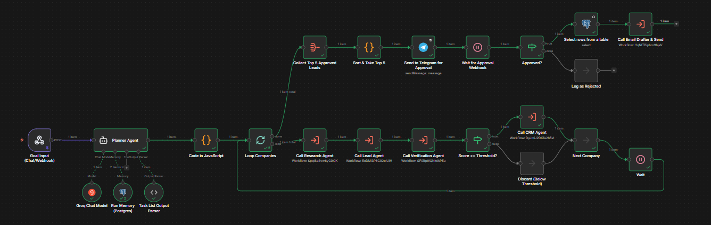
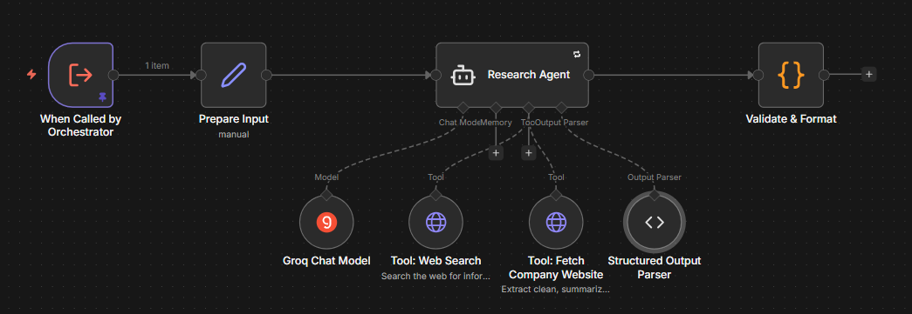
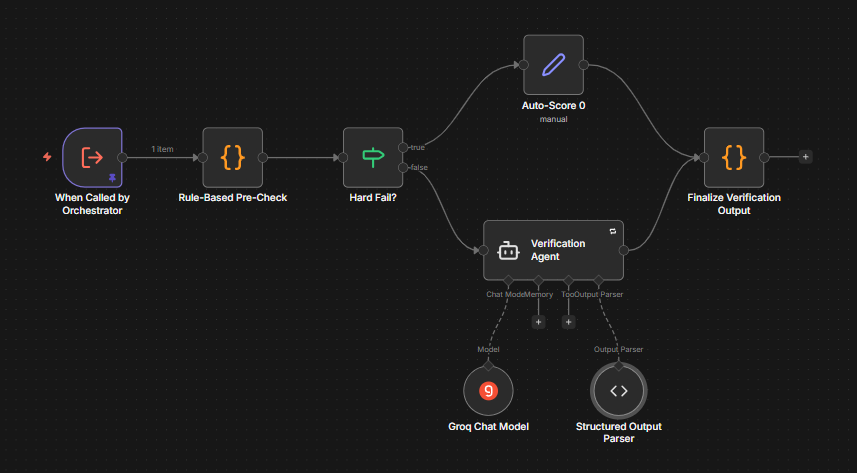
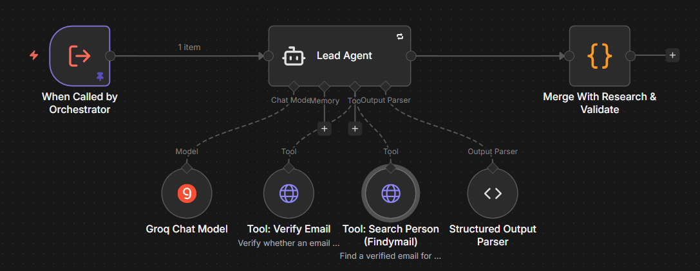
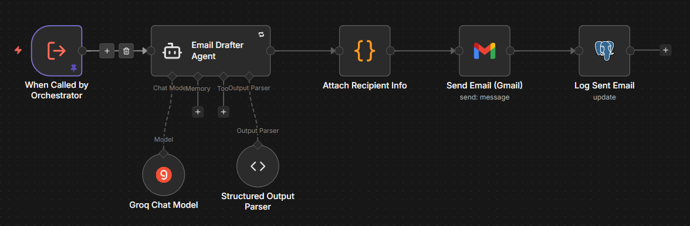

# Autonomous AI Employee

An n8n-based multi-agent system that takes a natural-language goal — *"find 5 SaaS companies like Notion, research them, find the decision maker, and add the best leads to my CRM"* — and autonomously executes it across web search, lead enrichment, verification, a CRM, and email, with a human approval checkpoint before anything gets sent.

This is a portfolio project built to demonstrate **n8n as an agent orchestration platform**: sub-workflow composition, structured LLM outputs, tool-calling agents, conditional branching, retries, human-in-the-loop approval, and error isolation — not just point-to-point automation.

## Architecture

```
User goal (webhook)
      ↓
Planner Agent (decomposes goal → target_count, industry, criteria, companies[])
      ↓
Loop Companies (one company at a time)
      ↓
Research Agent  →  Lead Agent  →  Verification Agent
      ↓                                    ↓
  (web search +          score >= threshold?
   extract)                    ↓ yes              ↓ no
                          CRM Agent            discard
                        (Postgres +
                         Airtable)
      ↓
Collect top 5 approved leads → Telegram approval message (Approve/Reject buttons)
      ↓ (human taps Approve)
Email Drafter Agent → Gmail send → log as sent
```

Each agent is its own **n8n sub-workflow**, called from the Orchestrator via Execute Workflow nodes with a defined JSON input/output contract — not one giant workflow with everything inline.

## Workflows

| File | Role | Model |
|---|---|---|
| `orchestrator.json` | Planner, company loop, approval routing | `qwen/qwen3.8-27b` |
| `sub_research_agent.json` | Web search + content extraction, company summary | `openai/gpt-oss-20b` |
| `sub_lead_agent.json` | Decision-maker search + email verification | `openai/gpt-oss-120b` |
| `sub_verification_agent.json` | Scores lead quality against ICP criteria | `qwen/qwen3.8-27b` |
| `sub_crm_agent.json` | Dedupe + upsert to Postgres/Supabase + Airtable mirror | — (deterministic, no LLM) |
| `sub_email_drafter.json` | Personalized outreach email + send | `openai/gpt-oss-20b` |

Models are deliberately split across three separate Groq model buckets (`gpt-oss-20b`, `gpt-oss-120b`, `qwen3.8-27b`) so agents running in the same loop don't compete for the same per-minute token quota.

### Workflow Images
## Orchestrator Workflow

## Research Agent

## Verification Agent

## Lead Agent

## CRM Agent

## Email Drafter & Sender


## External services used (all free-tier)

| Service | Used for | Notes |
|---|---|---|
| **Groq** | LLM inference | Free tier caps at 8,000 TPM per model — see [Rate limits](#rate-limits-and-token-budgeting) |
| **Exa** | Web search + content extraction | Replaced Tavily mid-project after a vendor/API change — see [Debugging journey](#debugging-journey--lessons-learned) |
| **Findymail** | Decision-maker search + email verification | Replaced Apollo (paywalled API) and Hunter (kept as a fallback option) |
| **Supabase (Postgres)** | Leads table + agent memory | Free tier, RLS disabled since only n8n touches it |
| **Airtable** | Visual CRM mirror | For a human-readable view of leads alongside the Postgres table |
| **Telegram** | Human approval | Replaced Slack after repeated app-permission/channel issues |
| **Gmail** | Sending outreach emails | OAuth2 |

## Setup

### 1. Database

Run in Supabase's SQL editor:

```sql
create table leads (
  id bigint generated always as identity primary key,
  lead_id text unique not null,
  company_name text,
  summary text,
  decision_maker_name text,
  title text,
  email text,
  email_confidence numeric,
  linkedin_url text,
  score numeric,
  verification_notes text,
  status text default 'pending_approval',
  created_at timestamptz default now(),
  updated_at timestamptz,
  sent_at timestamptz
);
create index idx_leads_email on leads(email);
create index idx_leads_status on leads(status);

create table n8n_chat_histories (
  id bigint generated always as identity primary key,
  session_id text not null,
  message jsonb not null,
  created_at timestamptz default now()
);
```

> `updated_at` and `sent_at` should have **no default** — if Supabase adds `now()` by default, drop it (`alter table leads alter column sent_at drop default;`) so these fields only populate when the corresponding event actually happens.

### 2. Credentials to create in n8n

- **Groq** — API key from [console.groq.com](https://console.groq.com)
- **Exa** — Header Auth credential, `x-api-key: <your key>`, from [exa.ai](https://exa.ai) ($10/mo free credits)
- **Findymail** — Header Auth credential, `Authorization: Bearer <your key>`, from [findymail.com](https://findymail.com)
- **Postgres** — Supabase connection string (use the **Session pooler**, port 5432)
- **Airtable** — Personal Access Token with `data.records:read/write` + `schema.bases:read` scopes
- **Telegram** — Bot token from @BotFather (see below)
- **Gmail** — OAuth2, connected via n8n's standard Google OAuth flow

### 3. Telegram bot setup

1. Message @BotFather → `/newbot` → copy the token
2. Message your new bot directly (bots can't message you first)
3. n8n Credentials → New → Telegram → paste the token
4. Get your chat ID via @userinfobot, or by calling `https://api.telegram.org/bot<TOKEN>/getUpdates` after messaging the bot
5. **n8n must be publicly reachable** for Telegram's inline-keyboard URL buttons to work — `localhost` URLs are rejected outright. Run `ngrok http 5678` and set the `WEBHOOK_URL` environment variable to the ngrok address before starting n8n, so `$execution.resumeUrl` resolves to a real public URL.

### 4. Import and wire up

1. Import all six workflow JSON files into n8n
2. Save each sub-workflow, then copy its workflow ID (from the URL) into the Orchestrator's corresponding Execute Workflow node
3. Attach credentials to each node per the table above

## Data contracts between agents

Each sub-workflow accepts and returns a defined JSON shape. The two fields most worth knowing about:

- **`website_domain`** — extracted deterministically in Research Agent's `Validate & Format` code node from the raw search tool output (not asked of the LLM directly — models were unreliable at including it correctly). Lead Agent falls back to a naive `companyname.com` guess if this is null, and flags the guess so Verification Agent can weight it accordingly.
- **`lead_id`** — generated once in Lead Agent (`companyname-timestamp`) and threaded through every downstream step. This is also what survives the Telegram approval round-trip (the Wait node only returns `action` + `lead_id` as query params), so CRM Agent's row is re-fetched by `lead_id` after approval rather than assuming the original lead object is still in scope.

## Known limitations / not yet tested at scale

- Only tested with `target_count: 1` end-to-end. The loop, inter-company pacing, and "collect top 5" logic haven't been exercised with multiple companies in one run.
- The Reject path (`Log as Rejected`) has not been triggered in a live run — only Approve has been tested.
- No retry/backoff has been tested for a genuinely down external API (Exa, Findymail) mid-run — only Groq's rate limits have been handled robustly.
- Verification Agent's scoring is only as good as its system prompt's calibration — it hasn't been validated against a labeled set of "should approve" vs. "should reject" leads.

## Rate limits and token budgeting

Groq's free tier enforces both a **TPM (tokens per minute)** and, for some models, an **OTPM (output tokens per minute)** cap — separately per model, not per account. Practical takeaways from hitting these repeatedly during development:

- Cap `max_tokens` explicitly on every Chat Model node (512 is generous for every agent in this project) — Groq pre-checks the *requested* ceiling against remaining quota, so an unset/high `max_tokens` can trigger a rejection even if the actual response would've been short.
- Set `Max Iterations` on every AI Agent node. Without it, a model can loop indefinitely calling tools, burning tokens with no natural stopping point. Note that with a Structured Output Parser attached, the model needs one extra iteration just to call `format_final_json_response` — budget for that.
- A `Wait` node (8-10s) between company loop iterations prevents consecutive Research Agent calls from stacking within the same 60-second TPM window.
- Splitting agents across different models (`gpt-oss-20b` / `gpt-oss-120b` / `qwen3.8-27b`) gives each its own quota bucket, which matters more than it sounds — it's the difference between one busy agent starving the whole pipeline and each agent having its own budget.

## Debugging journey / lessons learned

This project went through more provider changes and root-cause debugging than a typical build, which is arguably the more interesting part of it:

- **Tavily → Exa.** Tavily's API shape changed (GET/query-param auth → POST/Bearer-header) mid-project without warning; later hit a suspected account/credit issue. Switched to Exa, which turned out to also return richer structured entity data (funding, headcount, traffic) that improved summary quality.
- **Apollo → Findymail.** Apollo's REST API requires a paid plan; Findymail's free tier covers both person search and email verification on one key.
- **Proxycurl removed entirely.** LinkedIn's lawsuit shut the service down in 2025 — a reminder that scraping-adjacent APIs carry real platform risk, worth avoiding in a project meant to demonstrate durable engineering judgment.
- **Slack → Telegram.** Slack's app-permission model (bot install vs. reinstall, `chat:write.public`, channel-vs-app IDs in the picker) cost significant time for something that should be simple; Telegram's bot model has no equivalent friction and needs no public webhook registration for basic messaging.
- **Recurring "data goes null between nodes" bug.** The single most common bug class in this project: a Code node referencing `$json` when the actual data it needed lived on an earlier node (`$('NodeName').item.json`), because the immediately-preceding node's output had a different shape (an empty dedupe-check result, a Verification Agent's narrow `{score, notes}` output, an Airtable record's `fields.*` nesting). Fixed by explicitly referencing the source node rather than assuming `$json` carries everything forward.
- **A single stray `?` instead of `&`** in a Telegram button URL (`$execution.resumeUrl` already contains a `?signature=...` query string) silently broke the entire approval flow for several debugging rounds before being caught — a good reminder to inspect the actual constructed request, not just the error message, when something "should" work.
